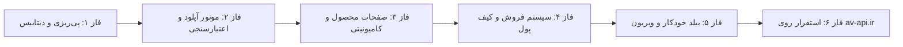

# نقشه راه و فازبندی توسعه AvPocket (Project Roadmap)

این سند مرجع اصلی پیشرفت پروژه **AvPocket** است. تمام مراحل توسعه گام‌به‌گام بر اساس این فازبندی اجرا و پیگیری خواهند شد.

---

---

## 📌 فاز ۱: پی‌ریزی، معماری و ساختار هسته (Foundation & Core Setup)
- [x] راه‌اندازی ساختار اصلی پروژه و اسکلت‌بندی (Scaffolding).
- [x] تنظیم فایل‌های محیطی (`.env.example` و پیکربندی اولیه).
- [x] طراحی شمای دیتابیس و مایگریشن‌ها:
  - جدول کاربران (`users`) با پشتیبانی از نقش‌ها (`admin`, `developer`, `buyer`).
  - جدول دارایی‌ها (`assets`): نوع فایل، تگ‌ها، وضعیت انتشار.
  - جدول نسخه‌ها (`asset_versions`): شماره نسخه، لاگ تغییرات، هش فایل، مسیر ذخیره‌سازی.
  - جدول دسته‌بندی‌ها و تگ‌های اکوسیستم پاکت‌ماین (`categories`, `tags`).
- [x] احراز هویت و مدیریت نشست‌ها (Email/Password و آماده‌سازی OAuth گیت‌هاب).
- [x] کامیت و پوش تغییرات فاز ۱ به گیت‌هاب.

---

## 📌 فاز ۲: موتور آپلود و اعتبارسنجی هوشمند پاکت‌ماین (Core MVP - Inspector)
- [x] سیستم آپلود فایل‌های دارایی (`.phar`, `.zip`, `.mcworld`, `.geo.json`).
- [x] توسعه **Plugin Inspector** اختصاصی PocketMine-MP:
  - باز کردن خودکار محتوای `.phar` / `.zip`.
  - استخراج خودکار و پارس داده‌های `plugin.yml` (نام، نسخه، نسخه API سازگار مانند PM4/PM5، نویسندگان، پیشنیازها).
- [x] سیستم اسکن امنیتی اولیه کد (Anti-Backdoor Scanner):
  - شناسایی توابع مشکوک (`eval`, `shell_exec`, `system`, `base64_decode` پرخطر، وب‌هوک‌های مشکوک دیسکورد).
- [x] اعتبارسنجی نسخه‌ها و ذخیره‌سازی امن فایل‌ها در استوریج.
- [x] کامیت و پوش تغییرات فاز ۲ به گیت‌هاب.

---

## 📌 فاز ۳: ویترین مارکت و تجربه کاربری (Showcase & Community)
- [x] طراحی و پیاده‌سازی صفحه اصلی (Catalog):
  - فیلتر بر اساس نسخه API پاکت‌ماین (PM4, PM5 و ...).
  - فیلتر بر اساس نوع دارایی (پلاگین، مپ، مدل، ویریون، کانفیگ).
  - مرتب‌سازی بر اساس محبوب‌ترین، جدیدترین، بیشترین دانلود.
- [x] صفحه اختصاصی نمایش محصول (Product Showcase):
  - رندر غنی `README.md` و مستندات به همراه استایل دارک مدرن.
  - گالری تصاویر و اسکرین‌شات‌ها.
  - تب لیست نسخه‌ها و تاریخچه تغییرات (Changelog).
  - دکمه دانلود مستقیم فایل با شمارشگر دانلودها.
- [x] سیستم تعاملی جامعه:
  - سیستم امتیازدهی و نظرات (Reviews & Star Ratings).
  - سیستم گزارش باگ و پرسش‌وپاسخ (Lightweight Issue Tracker).
- [x] پروفایل عمومی توسعه‌دهندگان (نمایش دارایی‌ها، مدال‌ها، کل دانلودها، لینک‌های ارتباطی).
- [x] کامیت و پوش تغییرات فاز ۳ به گیت‌هاب.

---

## 📌 فاز ۴: سیستم مالی، خرید و مارکت‌پلیس (Monetization & Marketplace)
- [x] تفکیک دارایی‌های رایگان (Free/Open-Source) و ویژه (Premium).
- [x] سیستم کیف پول کاربران (User Balance & Wallet).
- [x] اتصال درگاه پرداخت آنلاین (شتابی / زرین‌پال یا درگاه‌های واسط متناسب با دامنه `.ir`).
- [x] سیستم تسویه‌حساب فروشندگان و محاسبه کارمزد پلتفرم.
- [x] وب‌سرویس اعتبارسنجی لایسنس (License Verification API):
  - چک کردن لایسنس هنگام راه‌اندازی پلاگین در سرورهای ماینکرافت خریدار.
- [x] کامیت و پوش تغییرات فاز ۴ به گیت‌هاب.

---

## 📌 فاز ۵: اتوماسیون CI و تزریق ویریون (Poggit-like CI & Virions)
- [ ] اتصال وب‌هوک‌های GitHub:
  - کامپایل و بیلد خودکار فایل `.phar` با زدن Git Tag یا ساخت Release در ریپازیتوری دولوپر.
- [ ] موتور تزریق خودکار ویریون (Virion Injector):
  - تزریق خودکار کتابخانه‌های مشخص‌شده در فایل مانیفست به داخل فایل phar نهایی.
- [ ] کانال‌های انتشار چندگانه (Stable, Beta, Dev).
- [ ] کامیت و پوش تغییرات فاز ۵ به گیت‌هاب.

---

## 📌 فاز ۶: استقرار، ایمن‌سازی و بهره‌برداری (Production & Deployment)
- [ ] پیکربندی داکر (`Dockerfile` و `docker-compose.yml`) برای استقرار ایزوله در لینوکس.
- [ ] استقرار روی سرور لینوکس متصل به دامنه **`av-api.ir`**.
- [ ] پیکربندی Nginx معکوس و تنظیم SSL دامنه.
- [ ] راه‌اندازی ورکرها و صف‌های پس‌زمینه (Queues/Workers) برای پردازش‌های سنگین بیلد و تحلیل امنیتی.
- [ ] مانیتورینگ، بک‌آپ خودکار و لاگین خطاها.
